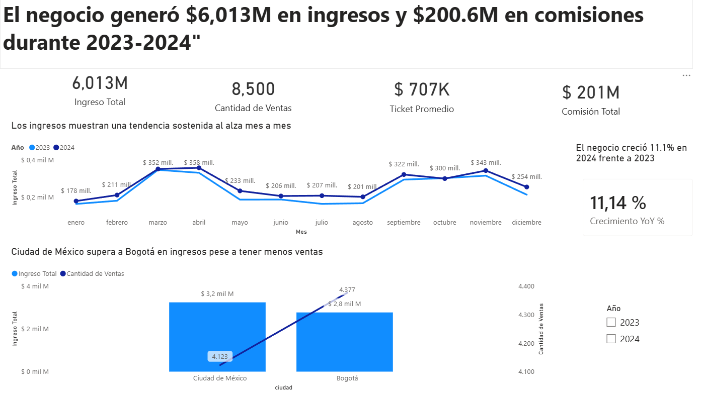
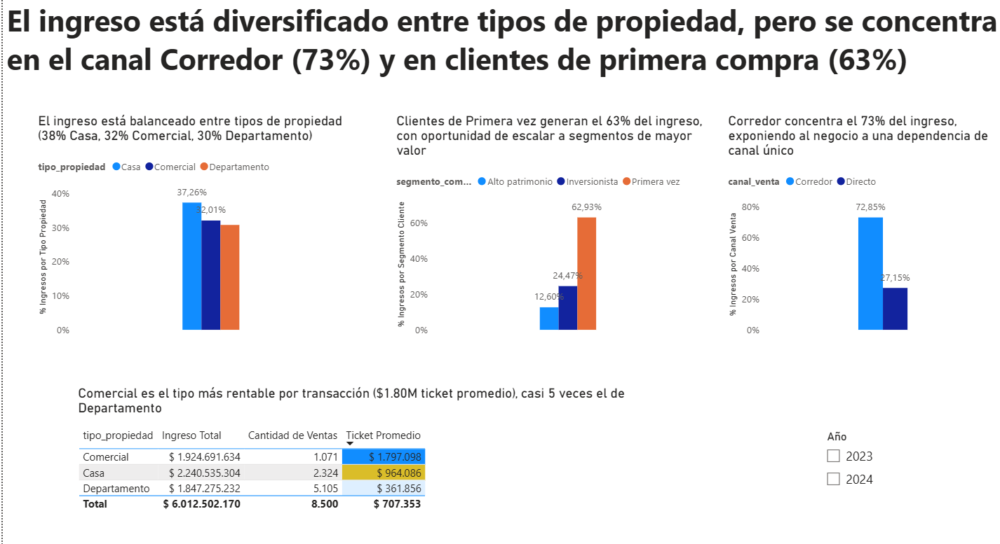
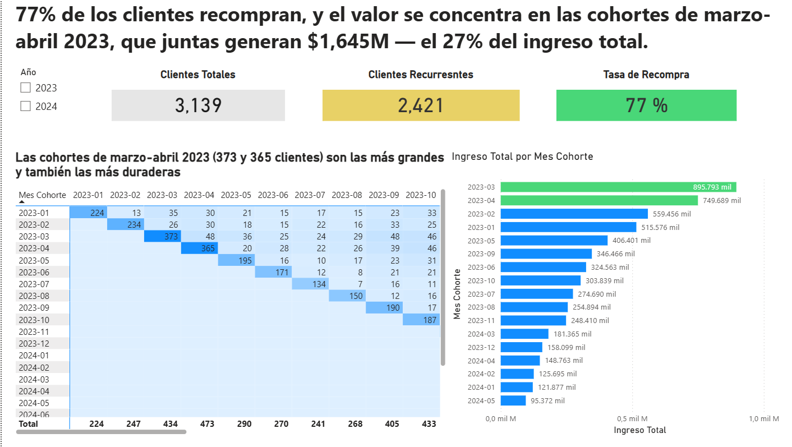

# Andes Capital Real Estate: estrategia comercial (Power BI)

Proyecto de formación en Data Analytics, con datos simulados. Tablero de 3 páginas que analiza las ventas de una inmobiliaria en Ciudad de México y Bogotá entre 2023 y 2024.

## Contexto y problema de negocio
La dirección comercial necesita saber de dónde viene el ingreso, cuánto cuesta en comisiones y si los clientes vuelven a comprar.

- ¿Cuánto ingreso y comisión generó el negocio y cómo evolucionó de un año a otro?
- ¿En qué canales, tipos de propiedad y segmentos de cliente se concentra el ingreso?
- ¿Los clientes recompran y qué cohortes aportan más valor?

## Objetivo y herramientas
Evaluar el desempeño 2023-2024 por canal, tipo de propiedad, segmento y cohorte para decidir dónde actuar.
Power BI Desktop, Power Query (M), DAX y modelo de datos en estrella.

## Datos
Tres archivos CSV (datos simulados de un programa de formación):

| Archivo | Contenido |
|---|---|
| `hecho_ventas_propiedades.csv` | 8,500 ventas entre enero de 2023 y diciembre de 2024 |
| `dim_clientes.csv` | 3,500 clientes con segmento de comprador y país |
| `dim_propiedades.csv` | 8,000 propiedades con tipo, ciudad, barrio, habitaciones, tamaño y precio publicado |

Los CSV no se incluyen en el repositorio. Para reproducir el tablero, colócalos en una carpeta y ajusta la ruta en Power Query (ver `powerquery/`).

## Preparación y transformación
- Promoción de encabezados, reemplazo del punto decimal por coma en `porcentaje_comision` y tipado de columnas.
- Tabla de fechas `dim_fecha` creada en DAX.
- Modelo en estrella: la tabla de hechos se relaciona con `dim_clientes` y `dim_propiedades` (muchos a uno).
- Columnas calculadas para cohortes: primera compra del cliente, mes de cohorte, mes de venta y meses desde la primera compra.

## Metodología
- Participación porcentual con `CALCULATE` y `ALL`, para conservar el total al filtrar.
- Inteligencia de tiempo con `TOTALYTD`, `TOTALMTD` y `SAMEPERIODLASTYEAR`.
- Recompra: cliente con más de una venta en el periodo (sin ventana de tiempo fija).
- Cohortes por mes de primera compra cruzadas con el mes de venta.

## Resultados principales
- Ingreso de $6,013M y comisiones de $200.6M; 8,500 ventas; ticket promedio de ~$707K.
- El ingreso de 2024 fue 11% mayor que el de 2023.
- **73% del ingreso pasa por el canal Corredor.** El ticket y el perfil del cliente son casi iguales en ambos canales, pero la comisión promedio es 4.0% con corredor y 1.5% en venta directa. Los corredores generan el 88% de las comisiones.
- El 63% del ingreso viene de compradores de primera vez y el 77% de los clientes recompra.
- Las cohortes de marzo y abril de 2023 generan $1,645M, el 27% del ingreso total.

## Recomendaciones a evaluar
1. Impulsar la venta directa (escenario ilustrativo: mover el 10% del ingreso de corredor a directo reduciría las comisiones en ~$11M, con el mismo ticket y la misma conversión).
2. Comisiones escalonadas por volumen o tipo de propiedad.
3. Medir la concentración por corredor (requiere agregar su identificador al modelo).
4. Programa de seguimiento para compradores de primera vez y estudio de las cohortes más valiosas.

## Limitaciones
Datos simulados. El modelo no incluye identificador de corredor, costos de adquisición ni tiempos de cierre. El escenario de recomendación 1 es una estimación con supuestos.

## Estructura del repositorio
```
README.md
docs/modelo_de_datos.md      esquema, relaciones, tablas y columnas
docs/medidas_dax.md          catálogo de medidas con su código
dax/                         tabla de fechas y columnas calculadas
powerquery/                  código M de cada tabla
capturas/                    imágenes de las páginas del tablero
```

## Capturas del tablero




Tablero interactivo: agregar aquí el enlace publicado en Power BI Service (con datos simulados).
